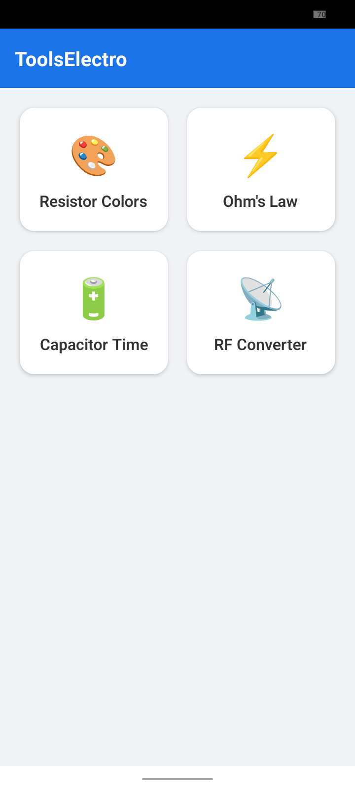
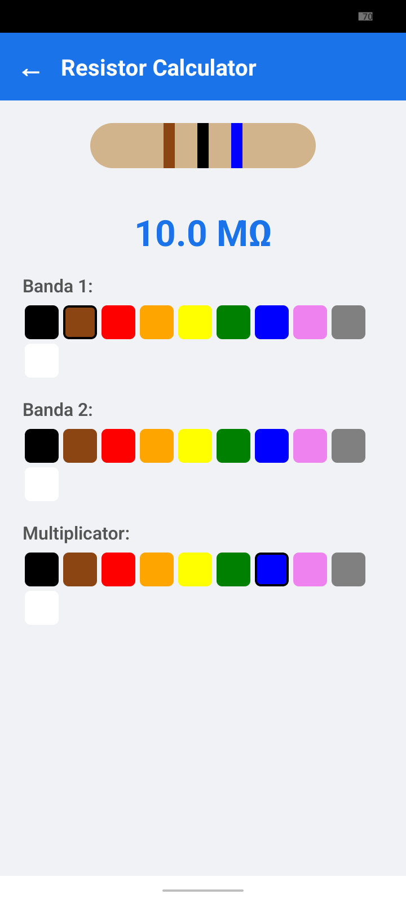

ANDROID APP FOR ELECTRONICS ENGINEERS

1) Features
   a)Resistor Color Code Calculator
   - It allows users to enter the band colors of a resistor and calculate the resistance value.

b)Ohm's Law Calculator
   - Calculates voltage, current or resistance based on Ohm's law, providing a simple interface for entering values.

c)Capacitor Charge/Discharge Calculator
   - Calculates the charge/discharge time of a capacitor based on the resistance and capacitance values ​​entered by the user.

d)Frequency to Wavelength Converter
   - Converts frequency to wavelength and vice versa, useful for RF projects

3) Tech: React Native, TypeScript, Expo

4) Screenshots

4) Installation

git clone https://github.com/GeoTuxMan/ElectroTools.github

cd ElectroTools

npm install

npm install -g expo-cli

5) Running the App

npx expo start

6) Testing on Physical Decice

Install Expo Go from App Store (iOS) or Google Play (Android)

Start the development server: npx expo start

Scan the QR code with Expo Go app

7) Building the app (.apk)

npm install -g eas-cli

expo install --check

eas build -p android --profile preview

Download apk file from expo.dev
